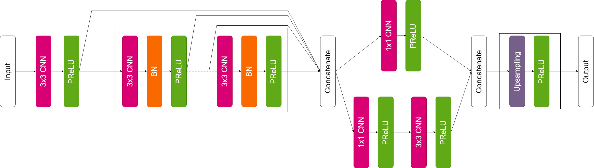
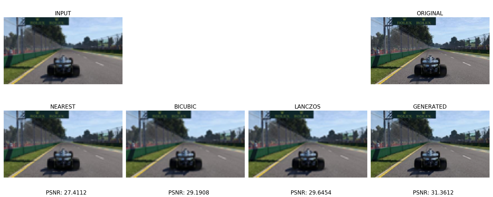
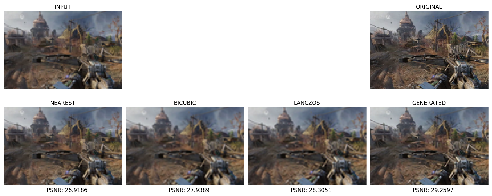
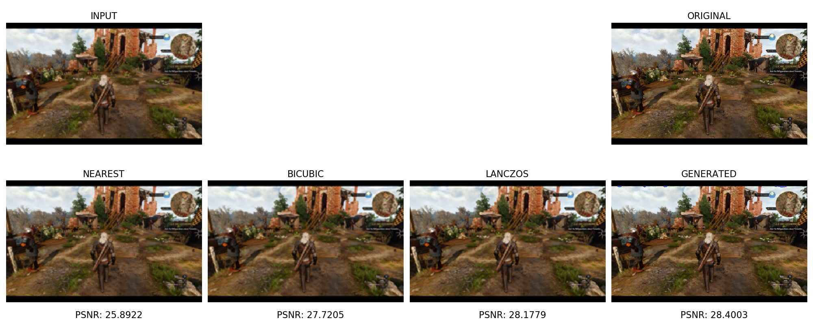

# Deep Learning in Video Games: Super-Resolution

A Keras based implementation of

- Single Image Super-Resolution using a RestNet (SISRRN)
 
## **Requeriments**

- python
- TensorFlow or TensorFlow-gpu v1.14
- Keras v2.2.4
- Pillow
- Skimage
- Numpy

## **Executing**
**Test**

Apply Super Resolution for image file:

```shell
python Test.py --input_dir ./img/img.jpg --output_dir ./out/ --model_dir ./model/model.h5
```
    '-i', '--input_dir': Path for input image

    '-o', '--output_dir': Path for Output image

    '-m', '--model_dir': Path for model

**Train**

If you want to train a new model with your own dataset, you can run:

```shell
python Train.py --input_dir ./data/ --output_dir ./out/ --model_dir ./model/ --epochs 5 --batch_size 64 --scale 2
```
    '-i', '--input_dir': Path for input images

    '-o', '--output_dir': Path for Output images

    '-m', '--model_dir': Path for model

    '-e', '--epochs', action='store': Number of epochs for train

    '-b', '--batch_size', action='store': Batch size for train

    '-s', '--scale': Upsampling scale (2 == x2, 4 == x4, ...)

# Model



# Result


---

---

---

# Author

[Imar Abreu Díaz](https://www.linkedin.com/in/imar-abreu-diaz-89ba11181/) - Computer Engineering Student

# License

This project is licensed under the [MIT License](LICENSE)